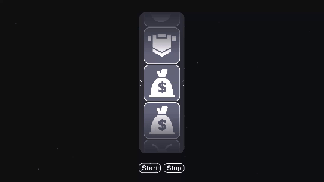

# 🎰 TASK_Slot — Mini Slot (AxGrid FSM)

## 📂 Location

Весь авторский код находится в:

```
Assets/TASK_Slot
```
Демо сцена: **Assets/TASK_Slot/Scenes/Demo.unity**

---



# 🧠 Архитектура

Проект построен на базе **AxGridTools** и использует:

* FSM (Finite State Machine)
* Model + EventManager
* UIButtonDataBind
* ScriptableObject конфигурацию
* Object Pooling для UI

Архитектура разделена на слои:

---

## 🔹 Core

```
Scripts/Core
```

* `SlotConfig` — ScriptableObject с параметрами слота
* `SlotEntryPoint` — инициализация Model и FSM
* `SlotEvents` — константы событий
* `SlotKeys` — ключи модели
* `SlotStates` — имена состояний
* `SlotItem` — сущность элемента слота

---

## 🔹 FSM

```
Scripts/Fsm
```

Состояния:

* `SlotIdleState`
* `SlotSpinUpState`
* `SlotSpinningState`
* `SlotStoppingState`
* `SlotResultState`

FSM:

* управляет переходами
* разрешает/блокирует кнопки через Model
* выбирает целевой результат
* отправляет события в UI

---

## 🔹 View

```
Scripts/View
```

### SlotReelSpawnerUi

* Реализует бесконечный скролл
* Использует пул из 7 ячеек
* Обрабатывает плавный разгон и торможение
* Выполняет snap к центру
* Получает сигналы от FSM
* Имеет UnityEvents для подписки на события: начало вращения, начало остановки, полная остановка

### Cell

* `SlotCellView`
* `ISlotCellAnimator`
* `SlotCellScalePopAnimator`

Отвечают за отображение и анимацию ячейки.

---

## 🔹 Utils

* `WeightRandomItemUtil` — выбор предмета по весам

---

## 🔹 Tools

* `FullScreenEffect`
* `UIButtonScaleAnimator`

Дополнительные UI/FX элементы.

---

# ⚙️ Конфигурация

Элементы слота задаются через `SlotConfig` (Resources).

`SlotConfig` используется как единый источник данных для FSM и UI
(с защитой от редактирования элементов в realtime).

---

# 🔄 Принцип работы слота

### 1️⃣ Старт

* FSM переходит в SpinUp
* UI начинает плавный разгон

### 2️⃣ Спин

* Бесконечный скролл
* Элементы переносятся наверх при выходе за нижнюю границу
* Stop доступен через 3 секунды

### 3️⃣ Остановка

* FSM выбирает целевой `SlotItem`
* UI плавно тормозит
* Выполняется snap ближайшей ячейки к центру
* В центре гарантированно оказывается целевой элемент

### 4️⃣ Результат

* Запускаются анимации и эффекты
* FSM переходит в Result
* Кнопка Start снова активна

---

# ✨ Визуальные эффекты

Используются:

* UGUI маска
* Плавные анимации масштабирования
* Частицы через ParticleEffectForUGUI

---

# 📦 Third-party Assets

* Dark Theme UI
  [https://assetstore.unity.com/packages/2d/gui/dark-theme-ui-199010](https://assetstore.unity.com/packages/2d/gui/dark-theme-ui-199010)

* ParticleEffectForUGUI
  [https://github.com/mob-sakai/ParticleEffectForUGUI](https://github.com/mob-sakai/ParticleEffectForUGUI)

* Cartoon FX Remaster Free
  [https://assetstore.unity.com/packages/vfx/particles/cartoon-fx-remaster-free-109565](https://assetstore.unity.com/packages/vfx/particles/cartoon-fx-remaster-free-109565)

---

# 🧩 Технические особенности

* Отсутствие runtime Instantiate во время спина
* Чёткое разделение логики и визуала
* FSM не знает UI-координат
* UI не принимает решения о результате
* Используются константы вместо вручную вписанных строк
* Используется объектный пул